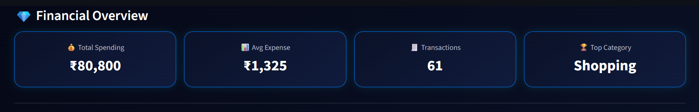
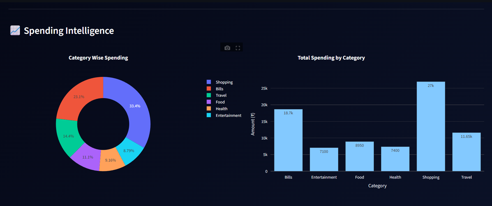
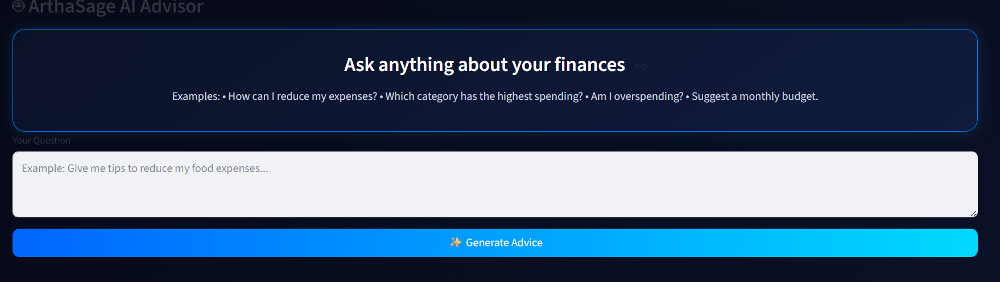
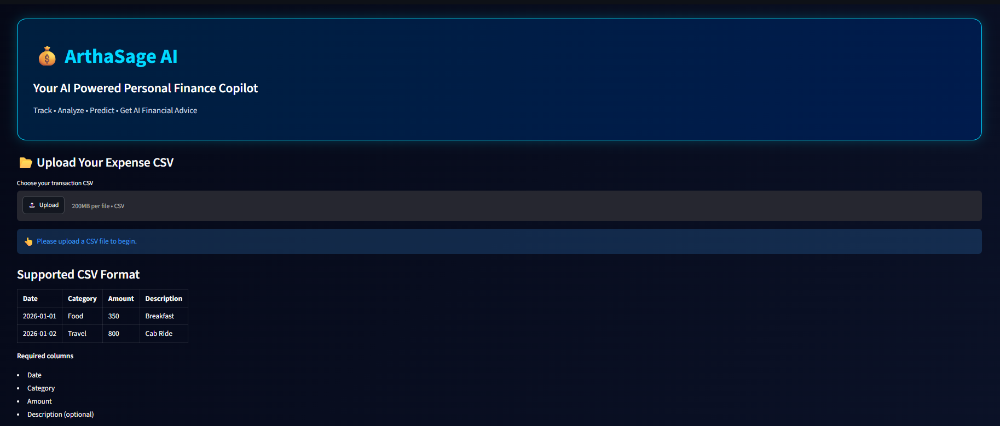
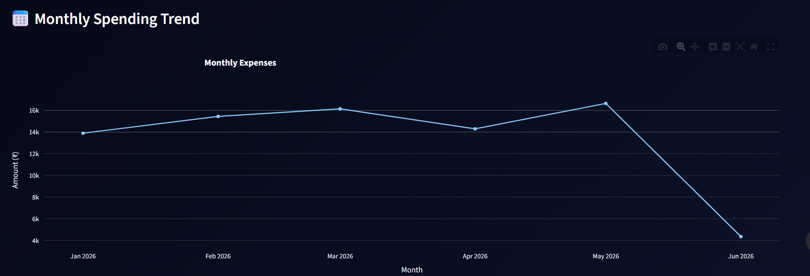

# 💰 ArthaSage AI – Personal Finance Copilot

An AI-powered Personal Finance Dashboard built with **Streamlit**, designed to help users analyze their spending, visualize financial trends, and receive intelligent financial guidance. Users can upload their own transaction history as a CSV file and instantly explore interactive analytics.

---

## 🚀 Features

* 📂 Upload your own expense CSV
* 💰 Financial Overview Dashboard
* 📊 Total Spending, Average Expense & Transaction Metrics
* 🏆 Top Spending Category Detection
* 🥧 Interactive Category-wise Spending Analysis
* 📈 Monthly Spending Trend Visualization
* 📋 Transaction History Viewer
* 📥 Download Processed Dataset
* 🤖 AI Financial Advisor *(RAG-ready architecture for personalized financial guidance)*

---

## 🖥️ Tech Stack

**Frontend**

* Streamlit

**Data Processing**

* Pandas

**Visualization**

* Plotly Express

**AI (Planned / RAG Integration)**

* LangChain
* FAISS
* Google Gemini
* HuggingFace Embeddings

---

## 📂 Project Structure

```text
Expense-Tracking-RAG/
│
├── app.py
├── requirements.txt
├── README.md
│
├── data/
│   └── Personal_Finance_Dataset.csv
│
├── rag/
│   ├── __init__.py
│   └── rag_advisor.py
│
└── notebook/
    ├── Expenses.ipynb
    ├── Advices.ipynb
    └── Spending Analysis n anomaly detection.ipynb
```

---

## 📊 Dashboard

The application provides:

* Financial Overview Cards

  * Total Spending
  * Average Expense
  * Number of Transactions
  * Highest Spending Category

* Spending Intelligence

  * Category-wise Pie Chart
  * Category Spending Bar Chart
  * Monthly Expense Trend

* Transaction History Table

* AI Financial Advisor

---

## 📂 CSV Format

Upload a CSV with the following structure:

| Date       | Category | Amount | Description     |
| ---------- | -------- | ------ | --------------- |
| 2026-01-01 | Food     | 350    | Breakfast       |
| 2026-01-03 | Travel   | 800    | Cab Ride        |
| 2026-01-05 | Shopping | 1200   | Amazon Purchase |

### Required Columns

* Date
* Category
* Amount

### Optional Column

* Description

---

## ⚙️ Installation

Clone the repository:

```bash
git clone https://github.com/AyushiTaralkar/Expense-Tracking-RAG/Expense-Tracking-RAG.git

cd Expense-Tracking-RAG
```

Create a virtual environment:

```bash
python -m venv .venv
```

Activate the environment:

### Windows

```bash
.venv\Scripts\activate
```

### Linux / macOS

```bash
source .venv/bin/activate
```

Install dependencies:

```bash
pip install -r requirements.txt
```

---

## ▶️ Run the Application

```bash
streamlit run app.py
```

The application will launch locally at:

```text
http://localhost:8501
```

---

## 🤖 AI Advisor

The project includes a modular AI Advisor architecture.

Current capabilities:

* Expense summary
* Spending insights
* Budget recommendations

Planned enhancements:

* Retrieval-Augmented Generation (RAG)
* Personalized financial advice
* Budget optimization
* Expense anomaly detection
* Investment suggestions
* Financial document Q&A

---

## 📈 Future Enhancements

* Authentication
* Multi-user support
* PDF & Bank Statement Upload
* OCR-based Expense Extraction
* Voice-enabled AI Assistant
* AI Budget Planner
* Savings Goal Tracker
* Expense Forecasting
* Investment Recommendation Engine
* Mobile Responsive Dashboard

---

## 📸 Screenshots

Add screenshots of:

* Home Dashboard
* Analytics Section

* AI Advisor

* CSV Upload

* Monthly Trend


---

## 👩‍💻 Author

**Ayushi Taralkar**

B.Tech Computer Science Engineering
VELLORE INSTITUTE OF TECHNOLOGY 

---

## 📄 License

This project is intended for educational and portfolio purposes.
